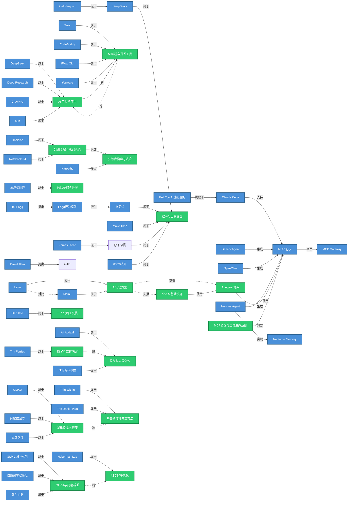

# 知识图谱

> 文档 last generated: 2026-05-28 | 共 123 个实体，44 个主题，1046 篇素材

## 核心关系图

## 图例

| 节点颜色 | 类型 | 数量 |
|---------|------|:----:|
| 蓝色 | 实体（人物/工具/概念） | 123 |
| 绿色 | 主题（研究领域） | 44 |

| 箭头样式 | 含义 |
|---------|------|
| `-->` | 明确关系（提出、属于、构建于、集成、使用、包含） |
| `-.->` | 弱关联 / 跨领域联系 |

## 主要知识集群

### 1. AI Agent 核心（MCP 生态）
Claude Code ← PAI → MCP → MCP Gateway / GenericAgent / OpenClaw
记忆层：Letta ↔ Mem0 / Nocturne Memory → Hermes Agent

### 2. AI 工具与编程
DeepSeek / Deep Research / Crawl4AI / n8n → Trae / CodeBuddy / iFlow / Youware

### 3. 知识管理
Obsidian + NotebookLM ← Karpathy（知识库构建）→ 沉浸式翻译（信息获取）

### 4. 效率方法论
Deep Work（Cal Newport）→ 微习惯（BJ Fogg）→ GTD（David Allen）→ Make Time → 80/20 → 原子习惯（James Clear）

### 5. 创作者生态
Ali Abdaal / Dan Koe / Tim Ferriss → 博客写作 → 播客与媒体 → 一人公司

### 6. 健康减重
信仰减重（Thin Within / Daniel Plan）←→ 饮食方法（OMAD / 间歇性禁食 / 正念饮食）
药物减重（GLP-1 / 口服司美 / 替尔泊肽）←→ 科学健康（Huberman Lab）

---

> 查看方式：用 Typora、VS Code（Markdown Preview Enhanced）、Obsidian、或直接在 GitHub 上查看。
> 如需交互式图谱，运行 `/llm-wiki graph` 生成 `knowledge-graph.html`。
